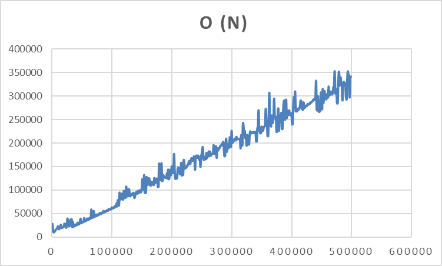

# Простейшая программа на Java для работы с числами

Этот репозиторий содержит простую программу на Java, которая считывает числа из файла и выполняет несколько операций над этими числами. В частности, программа находит минимальное число, максимальное число, вычисляет сумму и произведение чисел.

На вход программа принимает глобальный пусть к текстовому файлу, который содержит числа разделенные пробелом. Максимальное количество чисел - 1 млн.

Сборка:
```mvn clean package```

Запуск: ```java -jar target/TZ2_Maven-1.0-SNAPSHOT.jar```

Для запуска тестов:
```mvn clean test```

Пример работы программы:
```text
# numbers.txt
1 2 3 4 5 6 7 8 9 10 11 12 13 14 15
```
Ввод:
```
Enter full path to file
/home/user/Desktop/numbers.txt
```
Результат:
```
Min: 1
Max: 15
Sum: 120
Mult: 1307674368000
```

## Тест скорости работы

В примере была протестирована функция `_sum()`. Ось Y - количество элементов массива. По оси X - время выполнения в миллисекундах. Наглядно видно что программа выполняется за время O(n).

Для получения результата использовался следующий код:

```java

int testsCount = 500;
int multiplier = 1000;
long seed = 404187099;

for (int i = 1; i < testsCount; i++) {

    File tempFile = File.createTempFile("numbers", ".txt");
    BufferedWriter writer = new BufferedWriter(new FileWriter(tempFile));
    
    long[] randomNumbers = LongStream.generate(() -> new Random(seed).nextLong()).limit(i * multiplier).toArray();
    writer.write(Arrays.toString(randomNumbers).replaceAll("[\\[\\],]", ""));
    writer.close();
    
    long startTime = System.nanoTime();
    NumberArray numberArray = NumberArray.createFromFile(tempFile.getPath());
    BigInteger sum = numberArray._sum();
    long endTime = System.nanoTime();
    
    
    System.out.println((endTime - startTime) / 1000));
    
    tempFile.delete();
}

```

